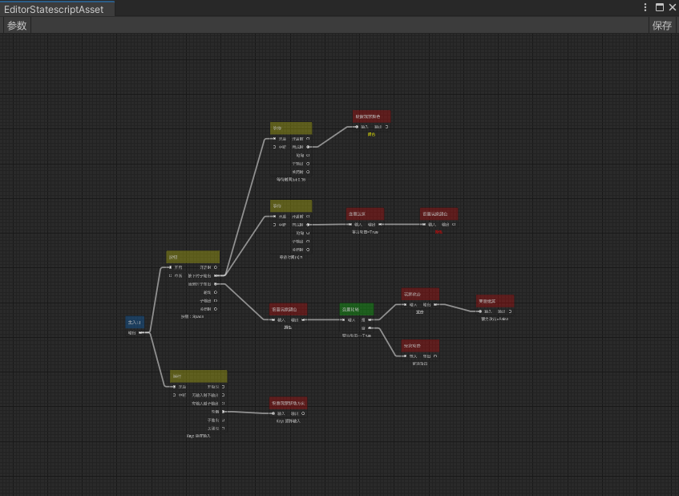

# Emilia-Flow

Emilia-Flow是基于[Emilia-NodeEditor](https://github.com/CCEMT/Emilia-NodeEditor)实现的Unity流图节点编辑器

## 特点

基于源生成实现 运行时无反射  
函数可作为端口  
运行时和编辑器分离  
可视化调试  
热重载

## 示例

~~~csharp
//FlowNodeMenu为菜单特性
[FlowNodeMenu("Test"), Serializable]
public class TestNodeAsset : TestBaseNodeAsset<TestNode>
{
    //注册值的输入端口
    [FlowInputValuePort("A")]
    public int a;

    [FlowInputValuePort("B")]
    public int b;
}

[FlowNodeGenerator]
public partial class TestNode : TestBaseNode<TestNodeAsset>
{
    //注册值的输出端口
    [FlowOutputValuePort("AddResult")]
    public int AddResult()
    {
        //获取a端口的值如果没有则返回默认值this.asset.a
        int xPort = GetInputValue(nameof(this.asset.a), this.asset.a);
        int yPort = GetInputValue(nameof(this.asset.b), this.asset.b);

        return xPort + yPort;
    }

    [FlowOutputValuePort("SubResult")]
    public int SubResult()
    {
        int xPort = GetInputValue(nameof(this.asset.a), this.asset.a);
        int yPort = GetInputValue(nameof(this.asset.b), this.asset.b);

        return xPort - yPort;
    }

    //注册函数输入
    [FlowInputMethodPort("Input")]
    public void Input()
    {
        Output();
    }

    //注册函数输出
    [FlowOutputMethodPort("Output")]
    public void Output()
    {
        InvokeOutputPort(nameof(Output));//调用所有连接到此端口的函数
    }

    //注册带参的函数输入
    [FlowInputMethodPort("InputArg")]
    public void InputArg(object arg)
    {
        OutputArg(arg);
    }

    //注册带参的函数输出
    [FlowOutputMethodPort("OutputArg")]
    public void OutputArg(object arg)
    {
        InvokeOutputPort(nameof(OutputArg), arg);//调用所有连接到此端口的函数并传递一个参数
    }
}
~~~

## 安装

Unity版本：2021.3+  
Odin版本：3.1.2+  

### Odin为付费插件请自行导入

### 使用unitypackage安装

在Tag界面中选择对应版本  [Tag界面](https://github.com/CCEMT/Emilia-Flow/tags)  
找到.unitypackage文件进行下载  
导入Unity之后在PackageManager界面中安装Editor Coroutines  

### 使用Unity Package Manager安装  

打开Packages/manifest.json

将以下内容添加进manifest文件中

~~~json
"com.emilia.kit": "https://github.com/CCEMT/Emilia-Kit.git?path=Assets/Emilia/Kit",
"com.emilia.node.editor": "https://github.com/CCEMT/Emilia-NodeEditor.git?path=Assets/Emilia/Node.Editor",
"com.emilia.flow": "https://github.com/CCEMT/Emilia-Flow.git?path=Assets/Emilia/Flow"
~~~

## 例子

是基于Emilia-Flow实现的Unity类守望先锋Statescript编辑器

## 开始

以下为例子中的实现

### 创建编辑器文件

~~~csharp
[CreateAssetMenu(menuName = "Emilia/Statescript/EditorStatescriptAsset", fileName = "EditorStatescriptAsset")]
public class EditorStatescriptAsset : EditorFlowAsset
{
    public override string outputPath => "Assets/Emilia/Statescript/Resource/Config";

    public override Type[] subNodeTypes => new[] {typeof(IStatescriptNodeAsset)};
}
~~~

outputFilePath 运行时文件最终保存的路径  
subNodeTypes 节点基类，用于创建节点时菜单过滤

### 创建节点基类

~~~csharp
public interface IStatescriptNodeAsset { }

public abstract class StatescriptNodeAsset<T> : UniversalFlowNodeAsset<T>, IStatescriptNodeAsset where T : FlowNode, new() { }

public abstract class StatescriptNode<T> : UniversalFlowNode<T> where T : FlowNodeAsset { }
~~~

### 运行

~~~csharp
//创建加载器
FlowLoader flowLoader = new FlowLoader();
flowLoader.runtimeFilePath = "Assets/..";
flowLoader.editorFilePath = "Assets/..";

//这里接入自己项目里面的加载API
flowLoader.onLoadAsset = OnLoadAsset;

//这里是反序列化（如果修改了序列化方案则需要修改，这里默认使用Odin序列化）
flowLoader.onLoadStateMachineAsset = (bytes) => SerializationUtility.DeserializeValue<StateMachineAsset>(bytes, DataFormat.Binary);

string fileName = "xx";//不带后缀的文件名

runner = FlowRunnerUtility.CreateRunner();
runner.Init(fileName, flowLoader, gameObject);
~~~

### 生命周期

~~~csharp
runner.Start();//开始运行
runner.Update();//更新
runner.Dispose();//停止运行
~~~

## WIKI

[WIKI-Home](https://github.com/CCEMT/Emilia-Flow/wiki)

## 联系

email：<1076995595@qq.com>  
QQ群：956223592  
